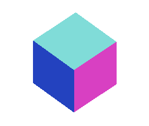
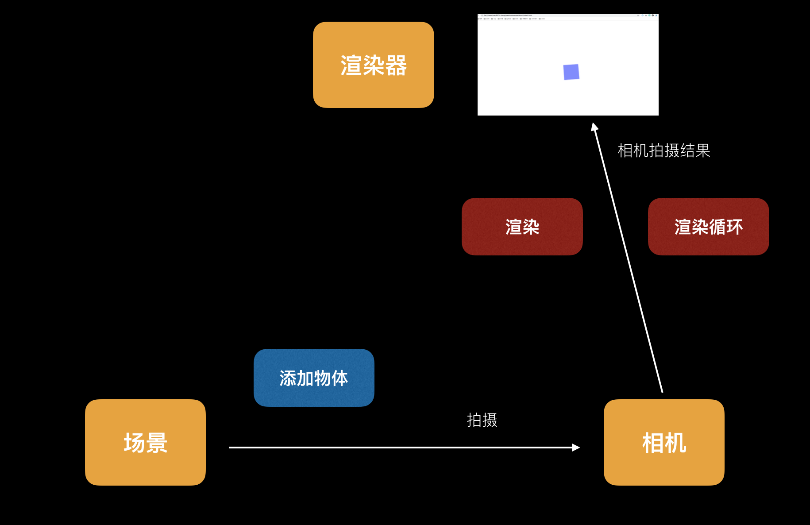

# 图形学之从第一个3Ddemo说起

## ① • 前奏

> 我们要实现下面这样的效果，一个正方体，在一个三维空间中自由转动



思考：
* 构建一个正方体模型
* 基于某种规则让正方体不断是移动
* (延伸)对每个面添加颜色
* (延伸)在一个固定的位置添加灯光

[源码地址](../example/demo1/index.html)
```js
// 场景
const scene = new THREE.Scene();

// 相机
const camera = new THREE.PerspectiveCamera(75, window.innerWidth / window.innerHeight, 0.1, 1000);

// 渲染器
const renderer = new THREE.WebGLRenderer();
renderer.setSize(window.innerWidth, window.innerHeight);

document.body.appendChild(renderer.domElement);

// 几何模型
const geometry = new THREE.CubeGeometry(1, 1, 1);

// 材质
const material = new THREE.MeshBasicMaterial({
  color: 0x00ff00
});

// 纹理贴图
const cube = new THREE.Mesh(geometry, material);

scene.add(cube);

// 相机位置
camera.position.z = 5;

// 渲染
const render = () => {
  requestAnimationFrame(render);
  cube.rotation.x += 0.04;
  cube.rotation.y += 0.04;
  renderer.render(scene, camera);
}

// 执行渲染
render();
```

以上我们先不解释为什么要这样写，请往下看

## ② • 了解图形学
在正式实现上面的 demo 之前，我们先梳理一波概念

### 图形学
计算机图形学 (Computer Graphics，简称CG) 是一种使用数学算法将`二维`或`三维`图形转化为计算机显示器的`栅格`形式的科学。简单地说，计算机图形学的主要研究内容就是研究如何在计算机中表示图形、以及利用计算机进行图形的计算、处理和显示的相关`原理`与`算法`。

### WebGL
WebGL 把 JavaScript 和 OpenGL （ OpenGL 是一个跨语言跨平台的专业图形程序接口，可以用于二维或者三维的图像）结合在一起，从而为HTML5 中的绘图元素 Canvas 提供硬件 3D 加速渲染，使在网页上设计 3D 游戏等等成为可能。

WebGL（全写Web Graphics Library）是一种 3D 绘图协议，这种绘图技术标准允许把 JavaScript 和 OpenGL ES2.0 结合在一起，通过增加 OpenGL ES2.0 的一个 JavaScript 绑定，WebGL 可以为 HTML5 Canvas 提供硬件 3D 加速渲染，这样Web开发人员就可以借助系统显卡来在浏览器里更更流畅地展示3D场景和模型了，还能创建复杂的导航和数据视觉化。显然，WebGL技术标准免去了开发网页专用渲染插件的麻烦，可被用于创建具有复杂3D结构的网站页面，甚至可以用来设计3D网页游戏等

### OpenGL
OpenGL是基于操作系统抽象出来的一套实现可视化界面交互的规范

### ThreeJS
ThreeJS 是基于WebGL开发的一个开源框架，掩盖了很多模范的细节；threejs 也是 three + js，表示使用 javascript 来写 3D 程序。

所以我们入门图形学的时候，首先找一个好用的框架来进行辅助开发，这样能更好的实现所写即所见。

### 实现一个3D渲染的基础组建
实现一个3D渲染，需要3个基础建设：场景（scene）、相机（camera）和渲染器（renderer）；在 threejs 中构建一个场景只需要new一个对象即可，代码如下：
```js
var scene = new THREE.Scene();
```

场景是所有物体的容器，如果需要显示一个图形，就需要将图形加入到场景中。

相机决定了场景中那个角度的内容会显示出来。相机就像人的眼睛一样，人站的位置不同，角度不同，看到的景色也不同。

最后就是设置渲染器，渲染器决定了渲染的结果应该画在页面的什么元素上面，并且以怎样的方式来绘制。

### 实现一个3D渲染的基本流程


从这张图可以知道，完成一个 3D 渲染，除了3个基础组建之外，还有物体添加，渲染操作，渲染循环。

场景是一个容器，在容器中可以添加各种各样的内容，一个球体，一张图片，一个视频，一个模型。添加好了以后，相机会对场景进行拍照，然后通过渲染器渲染到我们的浏览器中。一次拍照只能是一张图像，要想实现图像的变动，就是需要不同的拍照渲染，也就实现了渲染循环。得到一组连续的图像，即为动画。

## ③ • demo重构
基于上面的知识点学习，我们可以将前面的项目进行一次代码重构。

[源码地址](../example/demo1/index2.html)

```js
var renderer, camera, scene, object;

// 创建场景
function initScene() {
  scene = new THREE.Scene();
}

// 创建相机
function initCamera() {
  camera = new THREE.PerspectiveCamera(75, window.innerWidth / window.innerHeight, 0.1, 1000);
  camera.position.z = 5;
}

// 创建渲染器
function initRenderer() {
  renderer = new THREE.WebGLRenderer();
  renderer.setSize(window.innerWidth, window.innerHeight);
  document.body.appendChild(renderer.domElement);
  renderer.setClearColor(0xFFFFFF, 1.0);
}

// 添加物体
function initObject() {
  var geometry = new THREE.CubeGeometry(1, 1, 1);
  var material = new THREE.MeshNormalMaterial();
  object = new THREE.Mesh(geometry, material);
  scene.add(object);
}

// 渲染
function render() {
  // 渲染循环
  requestAnimationFrame(render);
  object.rotation.x += 0.03;
  object.rotation.y += 0.03;
  renderer.render(scene, camera);
}

function threeStart() {
  initRenderer();
  initCamera();
  initScene();
  initObject();
  render();
}
window.onload = threeStart();
```

备注：requestAnimationFrame 方法告诉浏览器你要进行一个动画，通知浏览器调用一个特定的方法在页面常会之前来更新动画。最大的优势就是由系统来决定回调函数的执行时机。

## ④ • 阅读
[找一个契机学习一下新的领域知识](./chapter1.md)

[开启Threejs之旅](http://www.hewebgl.com/article/getarticle/50)
