# 图形学之WebGL的工作原理

## ① • 前言
> 计算机图形学是一门复杂而又多样化的技术。而webGL之前我们介绍过是一个在浏览器中实现三维效果的一套规范.既然是规范，自然有一套标准化流程，也就是它的工作原理

## ② • 为什么我们要了解原理
我们学习 react，学习 vue，学习 webpack，学习 node等等，势必会涉及到，这个框架的原理是什么，设计思路是什么？目的是为了更深入的学习和了解你所用的工具。

对于为什么要了解原理，其实就是为了刨根问底的探寻代码背后的逻辑；这样我们自己希望实现更复杂的东西时，就有了方向。

总结下就是：

1.扩充知识的维度，拓展思考逻辑

2.遇到晦涩难解的问题，可以方向

3.出现性能瓶颈的时候，知道从哪个节点和角度切入进行优化

## ③ • 概念先行
### 矩阵
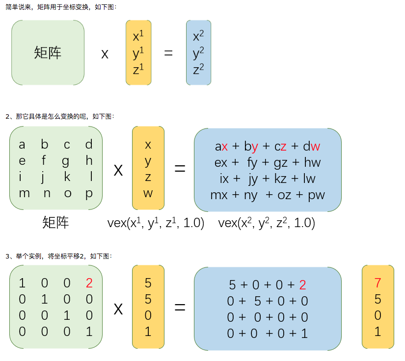

这里我们只需要知道矩阵用于坐标变换

### WebGL绘图API
WebGL 也是 HTML5 规范的一部分，从本质上讲它是一个增强型的图形绘制库，与 HTML5 的 2D Canvas 类似，只是 WebGL 是一个三维的绘图标准，并且同样使用了 canvas 元素。基于 Canvas 的绘图API，能够画直线、矩形、圆、弧线、贝塞尔曲线.

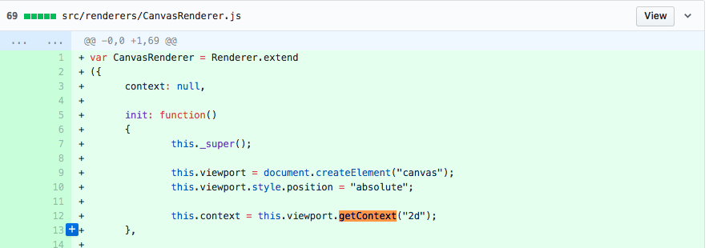
从three.js的第一个commit源码中，可以看出，webGL还是基于2d的canvas封装的一套3D标准

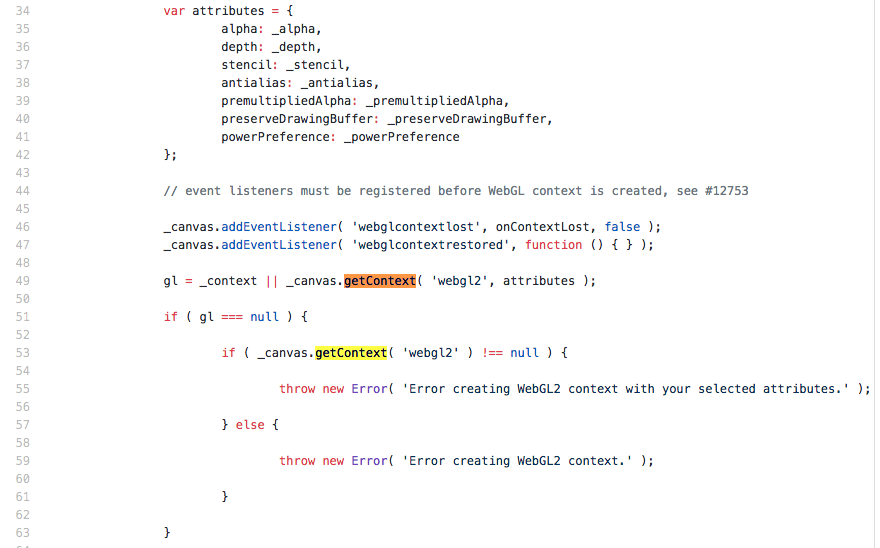
从three.js的最后一个版本源码中，可以看出，webGL 已经可以基于webgl 的 API 接口封装了

使用 WebGL 进行图形渲染至少要经理一下步骤：
* 创建一个画布元素
* 获取画布的上下文
* 初始化视口
* 创建一个或多个包含渲染数据的数组（通常是顶点数组）
* 创建一个或多个矩形，将顶点数组变换到屏幕空间
* 创建一个或多个着色器来实现绘制算法
* 使用参数初始化着色器
* 绘制

[Canvas-Demo]()
[WebGL-Demo]()

[WebGL绘图API](http://index.uskid.tech:8000/#/technology/frame)
[WebGL绘图API](./webgl-api.md)

## ④ • WebGL绘图流程
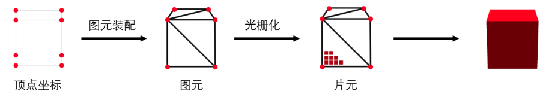

### 顶点坐标
顶点坐标，就是一个模型的所有的点。如下图：
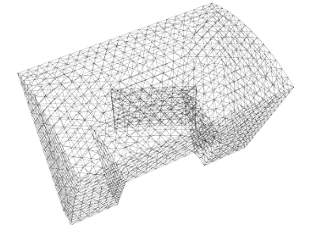
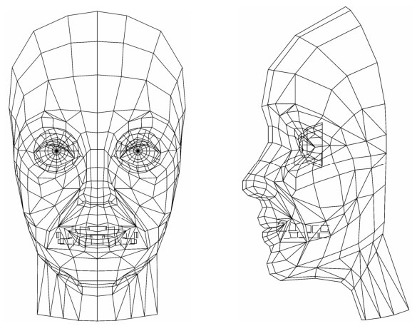

一个模型中有n个点组成，一个正立方体是8个顶点坐标；但是一个复杂的模型，顶点坐标就是无限个了。所以，一般都是来自三维软件导出的，或者框架生成的。
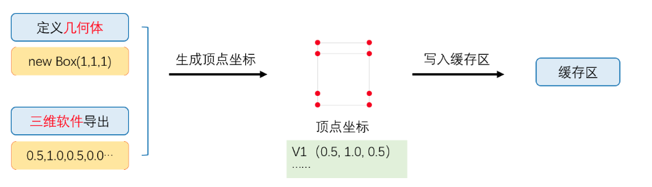
由于顶点数据往往成千上万，在获取到顶点坐标后，我们可以把它存储在显存，即缓存区内，方便GPU更快读取。

### 图元
所谓构造实体几何（Constructive Solid Crometry，CSG）表示，就是把复杂立体形状或景物用成为图元的基本三维几何形体的几何运算来表示的建模方法。

"立体形状可以看成三维空间内点的集合。在CSG表示方法中，运用隐函数 f(x, y, z) 来表示三维空间内点的集合。 if(x, y, z) = 0 表示空间中立体表面上曲面的点的集合。 f(x, y, z) <= 0 表示以曲面 f(x, y, z) = 0为边界的区域，称为半空间。在 CSG 表示中的图元能够由复数个半空间集合的交来表示，但必须是空间中的封闭区域。"

### 图元与图元之间的集合运算
每个图元都是三维空间内封闭区域点的集合。所谓集合运算，就是对上述三维空间内点的集合进行正则运算。常用的运算方式：并（U）、交（N）、差（-）等。

* 方块图元 A 和 B 的并、交、差运算
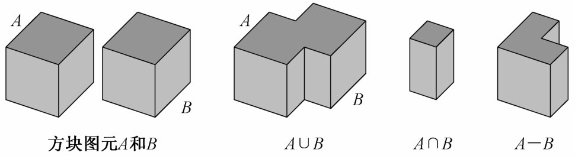

* CSG 模型及 CSG 树的一个简单示例
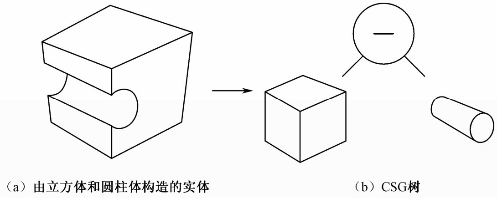

* 一颗正则 CSG 树
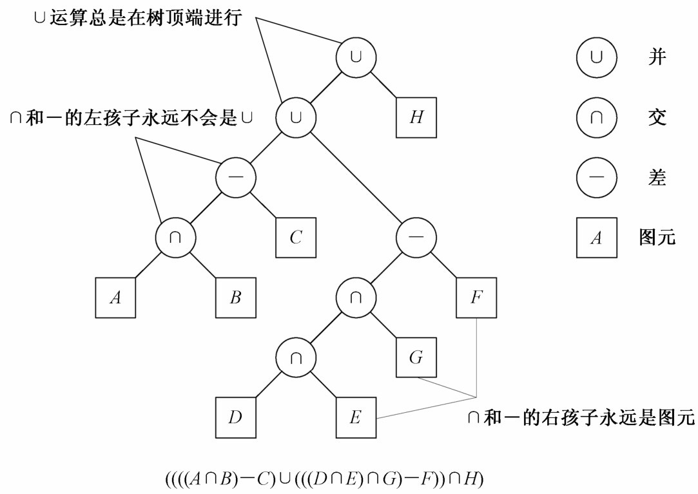

### 元球
元球（Meta-ball）表示方法利用密度来表示形体
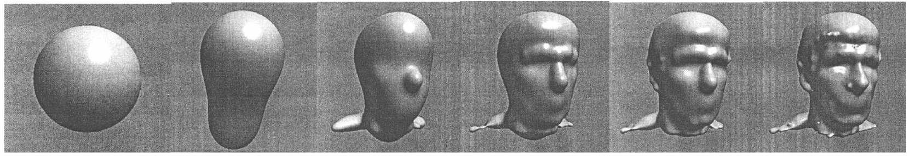

### 图元装配
图元装配就是由顶点生成的一个个图元（即三角形）。这个过程并非自动完成。而是需要我们先处理顶点，获取顶点坐标，传入顶点着色器，最后进行图元装配，形成图元。

区别：

1.如果绘制 2D 图形，没有问题 (gl_Position = position; )

2.如果绘制 3D 图形，即传入的顶点坐标是一个三维坐标，就需要转换成屏幕的二维坐标。比如：v(-0.5, 0, 1) 转换成为 p(0.2, -0.4),这个过程类似相机拍照

### 顶点着色器
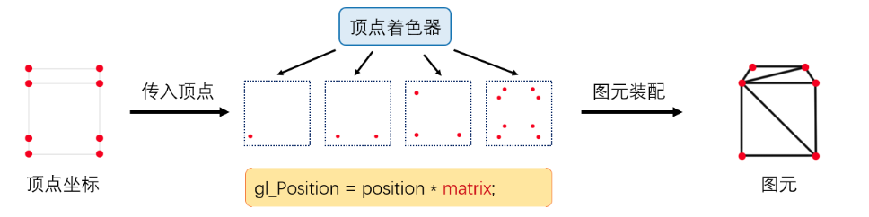
从上面的处理流程图可以看出来，顶点着色器先将坐标转换完毕，然后由GPU进行图元装配，有多少顶点，这段顶点着色器程序就运行多少次。

```js
gl_Position = position * matrix; 
```
应用的 matrix ，将三维世界坐标转换成屏幕坐标，这个矩阵叫投影矩阵算法。这个投影矩阵算法我是没有明白，后面阅读中有对应链接，感兴趣的话，自行查阅。

### 光栅化
计算机生成的图形是数字化的。多数情况下是通过光栅设备展现给用户的额。计算一个景物（多边形）在屏幕上的投影位置就是确定它在屏幕上的显示区域中覆盖了哪些像素。这一过程称为光栅化（Rasterization）或扫描转换（Scan Conversion）。

光栅化过程分为两步：

1. 首先确定像素位置（坐标）；
2. 用图形的颜色或其他属性对像素进行某种写操作，即着色

光栅化就是确定屏幕空间中最佳逼近与图形的像素集合。

和图元装配类似，光栅化也是可控的；所谓可控，就是可以认为操作。
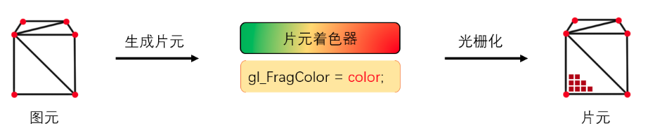
在图元生成完毕之后，我们需要给模型“上色”，而完成这部分工作，则是运行在 GPU 的“片元着色器”来完成。它同样是一段 opengl es 程序，模型看起来是什么质地（颜色、漫反射贴图等）、灯光等由片元着色器来计算。

### 片元着色器
片元着色器就是在图元变成片元之间，通过顶点，重新进行上色计算

## ⑤ • WebGL的工作流
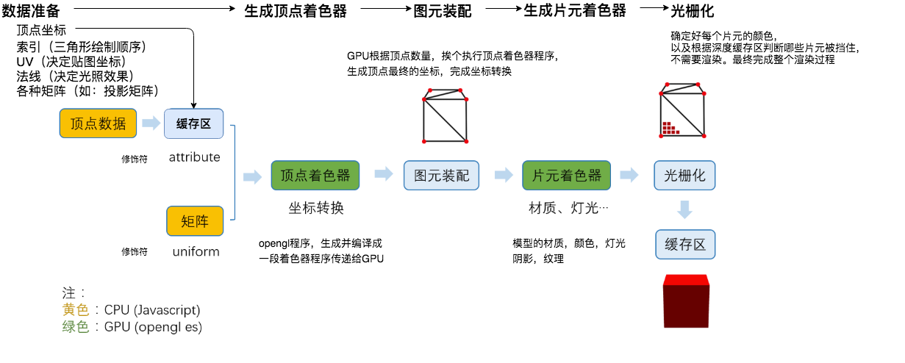

实际上，在这些内容之中，还有一些比较细节的逻辑：
* 物体建模
* 曲面表示
* 图形变换
* 光学投影
* 光栅算法

## ⑥ • 基于WebGL的常用第三方库
引擎 | 2D渲染(Canvas) | 2D渲染(WebGL) | 3D渲染 | VR发布
---|---|---|---|---
Pixi.js | 👍 |👍 |⛔ |⛔
Three.js | ⛔|⛔ |👍 |⛔
PlayCanvas |⛔ |⛔ | 👍|⛔
Layabox |👍 |👍 |👍 |👍
Egret |👍 |👍 |👍 |👍
Cocos2d-js |👍 |👍 | ⛔|⛔
Hilo |👍 |👍 | ⛔| ⛔

## ⑦ • ThreeJS的工作原理
我们了解了 WebGL 到底是怎么回事，WebGL 的工作原理，那么，基于 WebGL 的开源框架，three.js 其实也应该有一个大概的认知了。
其实就是基于 WebGL 工作流的封装,详细介绍，请查看下一节

[ThreeJS的那些API](./chapter4.md)

## ⑧ • 阅读
[图解WebGL&Three.js工作原理](https://www.cnblogs.com/wanbo/p/6754066.html)

[WebGL原生API及绘图基础](https://blog.csdn.net/wan_yanyan528/article/details/48494325)

[相关实例文章](https://www.aliyun.com/jiaocheng/topic_16073.html)

[投影矩阵的计算过程](https://www.cnblogs.com/qzzlw/p/3505284.html)

[3D游戏之投影矩阵算法技术实现](https://blog.csdn.net/jxw167/article/details/54137059)